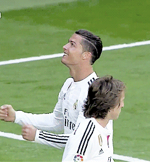

# Futbol_Proyecto
## Silvio de Jesús Marín Gómez
## Ulises Ricardo Torres Calderon

## Descripcion
¡Bienvenido al mundo de "Crazy Penalty"! En este emocionante juego de penales, la simplicidad se combina con la precisión para brindarte una experiencia única.

Sumérgete en la tensión de cada disparo mientras te enfrentas a los mejores porteros del mundo. Con una mecánica de juego intuitiva, pero desafiante, cada tiro requerirá habilidad y astucia para vencer al guardameta.

Compite contra tus amigos para demostrar quién tiene los nervios más fuertes y la habilidad más precisa. ¡Conviértete en una leyenda del fútbol con "Crazy Penalty" y muestra al mundo tu dominio en los penales!

¡Prepárate para la máxima emoción en cada disparo con "Crazy Penalty"!

### El juego consiste en una tanda de penales.

## INSTRUCCIONES

Al iniciar el juego aparecerá una ventana pequeña donde la magia comenzara a ocurrir.

El juego es para dos jugadores:               
Uno jugará con el pateador y el otro jugará con el portero.

El pateador jugará con las teclas 's' 'w'. 
Los cuales servirán para mover el balón hacia arriba y hacia abajo.

El portero jugará con las flechas 'arriba' y 'abajo'. Las cuáles servirán para mover al portero.

Cabe recalcar que el balón tiene una aceleración constante, el jugador no podra detener el balón, solo podrá cambiar la dirección a la que va.

## Puntaje
Por cada gol que marque el jugador será 1 punto

Por cada portería imbatida que tenga el portero será un punto.

El juego termina cuando un jugador llegue a los 5 puntos, ya sea que el portero termine ganando o el pateador sea el que salga con la victoria, ¡Todo puede pasar.

## ¿Cómo jugar?

El juego consiste en que el pateador tirará el penal y podrá mover la dirección del balón con las teclas ya mencionadas para intentár marcar gol en la portería rival y podrá cambiar la dirección del balón con la tecla 'p' para distraer al portero.

Se tendrá que refrescar la terminal por cada penal, esto se puede hacer tecleando la tecla 'q' del teclado y después tecleando 'make run' en la terminal para poder volver a tirar otro penal.

